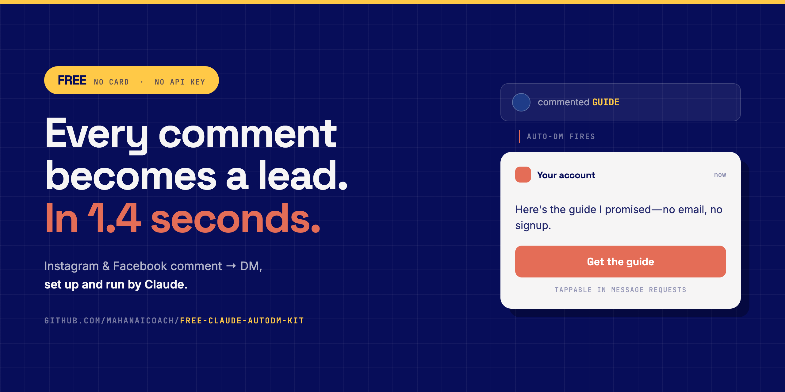

# free-claude-autodm-kit

**Someone comments a word on your post. They get a DM with a tappable button. In three
seconds. For free.**

You don't set it up in a dashboard. You drop this repo into Claude and say *"set up my
auto DM"* — it walks you through the whole thing, asks you three questions, and turns it on.

No monthly tool. No card. No code you have to read.

---

## Start here

**1.** Open [claude.ai/code](https://claude.ai/code) and clone this repo into it:

```bash
git clone https://github.com/Mahanaicoach/free-claude-autodm-kit && cd free-claude-autodm-kit
```

**2.** Say:

> set up my auto DM

That's it. Claude checks what's missing, walks you through the two accounts you need, writes
the DM with you, and switches it on. It'll ask you three things:

- What are you giving away?
- What word should people comment?
- Where does the link go?

Ten minutes, most of it waiting on Meta's permission screen.

Prefer to drive yourself? Complete step-by-step guides, with what you should see after every
step: **[Instagram](docs/INSTAGRAM.md)** · **[Facebook](docs/FACEBOOK.md)**. Then
**[the complete flow](docs/FLOW.md)** for everything you can do once it's running.

---

## What you get

**The link goes on a button.** This is the part most people get wrong. A DM to someone who
doesn't follow you lands in Instagram's *Message Requests* folder, and in that folder a URL
in the message text isn't tappable — it's grey text nobody clicks. A button is a real
button. Since almost everyone commenting on a post that reached them is not yet a follower,
this is most of your DMs. [Why buttons](docs/BUTTONS.md).

Everything else it does:

- **Keyword triggers** — `GUIDE`, `PRICE`, `ME`. Exact match or contains.
- **One post or every post.** Stack as many account-wide rules as you want, each with its
  own keywords.
- **A public reply too** — "Sent it to your DMs 📩" under the comment, so everyone else
  scrolling knows it's real.
- **Story replies** — someone replies to your story with a keyword, same automation.
- **Rotating wording** — up to 5 variants, picked at random, so repeat commenters don't get
  a photocopy.
- **Click tracking and tagging** — see who actually opened the link, tag them, follow up.
- **Real numbers** — triggered, sent, read, unique clicks, CTR. Per automation.
- **Nobody gets DMed twice.** Built in, not optional.
- Plus comment moderation, manual private replies, and the FAQ buttons on your DM screen.

**Instagram and Facebook, same tool.** Add `--platform facebook` and everything above works
on a Page. Instagram gets story-reply triggers and ice breakers; Facebook gets Call buttons
and real delivery receipts. Both are free — two connected accounts are included, so running
Instagram *and* a Page costs nothing.

Full list: [FEATURES.md](docs/FEATURES.md) · walk-through: [FLOW.md](docs/FLOW.md).

---

## Claude doesn't just set it up. It runs it.

Three commands where Claude does the thinking:

```bash
node bin/autodm.mjs write --offer "the 7-day content system" --link https://your-link.com
```

**`write`** drafts the DM, the button label, the public reply, and three reply variations
from your offer — then hands you the exact command to create it, or creates it with
`--create`.

```bash
node bin/autodm.mjs triage <postId>
```

**`triage`** reads your comment section and sorts it: question, buying signal, praise, spam,
negative. It drafts a public reply for each and flags who deserves a personal DM. It posts
nothing.

```bash
node bin/autodm.mjs answer <postId> --send
```

**`answer`** posts the replies triage judged safe. Spam, anything negative, and anything
it wasn't confident about are held back for you — a wrong auto-reply on a public post
isn't recoverable by deleting it.

**No API key. Ever.** These use your logged-in `claude` CLI if there is one, and fall back
to keyword rules if there isn't — so the repo works headless either way. When Claude Code
is the one running the repo, it does the reasoning itself and never shells out.

---

## Is it actually free

Yes, for one Instagram account, with no card and no trial clock.

It runs on [Zernio](https://zernio.com), which gives you **2 connected accounts free,
permanently** — one Instagram account uses one. There are no feature add-ons: the free tier
has the same API, the same inbox, the same automation. Instagram's own API is free. This
repo is MIT with zero dependencies.

The honest caveats, including what happens at account three, are in
[PRICING.md](docs/PRICING.md).

---

## What you need

| | |
|---|---|
| Instagram | **Business or Creator account.** Personal accounts can't use the API at all — switching is free and takes ten seconds. |
| Facebook | **A Page you admin.** Personal profiles can't be automated by anyone. Optional — Instagram alone is fine. |
| Node | 18 or newer (`node --version`) |
| Zernio | Free account — Claude walks you through it |

---

## Without Claude

Every command runs by hand. Nothing is hidden behind the assistant.

```bash
cp .env.example .env          # paste your Zernio API key
node bin/autodm.mjs doctor    # tells you exactly what's missing
node bin/autodm.mjs connect instagram
node bin/autodm.mjs posts     # find the post id

node bin/autodm.mjs new \
  --name "Free guide" \
  --keyword GUIDE \
  --dm "Hey! Here's the guide 👇 It's the exact thing I use — no email needed." \
  --button "Get the guide|https://your-link.com" \
  --reply "Sent it to your DMs 📩" \
  --post <post id>
```

Then watch it:

```bash
node bin/autodm.mjs logs <id>     # every comment that triggered it
node bin/autodm.mjs stats         # sent, read, clicks, CTR
```

`node bin/autodm.mjs help` has the rest. Five ready-made rules in
`node bin/autodm.mjs templates` — lead magnet, pricing, waitlist, booking, story reply.

---

## Testing it

Comment your keyword from a **second** account. Two things look like bugs and aren't:

- Your own account commenting on your own post doesn't trigger anything.
- The same person only ever gets one DM per automation, so commenting twice proves nothing.

If it's quiet: `node bin/autodm.mjs doctor`, then
[TROUBLESHOOTING.md](docs/TROUBLESHOOTING.md).

---

## What this isn't

It doesn't log into your Instagram, doesn't scrape, and doesn't DM people who never
contacted you. It replies to someone who commented — a public, voluntary action — through
Meta's official API. That's why it's allowed, and it's the line worth not crossing.
[RULES.md](docs/RULES.md).

---

## Docs

**Start:** [Instagram step by step](docs/INSTAGRAM.md) ·
[Facebook step by step](docs/FACEBOOK.md) · [Setup overview](docs/SETUP.md)

**Then:** [The complete flow](docs/FLOW.md) — everything you can do, in order

**Reference:** [Features](docs/FEATURES.md) · [Buttons](docs/BUTTONS.md) ·
[Troubleshooting](docs/TROUBLESHOOTING.md) · [Pricing](docs/PRICING.md) ·
[Rules](docs/RULES.md)

MIT. Built on the [Zernio API](https://docs.zernio.com).
